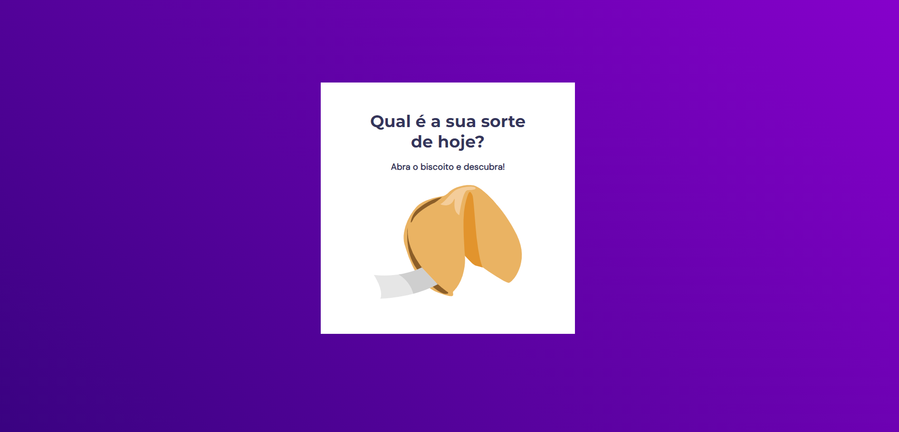

<h1 align="center"> Biscoito da sorte </h1>

Projeto promovido pela rocketseat para ensino de tecnologias WEB.

  <a href="#-tecnologias">Tecnologias</a>&nbsp;&nbsp;&nbsp;|&nbsp;&nbsp;&nbsp;
  <a href="#-projeto">Projeto</a>&nbsp;&nbsp;&nbsp;|&nbsp;&nbsp;&nbsp;
  <a href="#-layout">Layout</a>&nbsp;&nbsp;&nbsp;|&nbsp;&nbsp;&nbsp;
  <a href="#memo-licença">Licença</a>

  

 

  

[🔗 Clique aqui para acessar](https://devleuuon.github.io/fortuneCookie/)

## 🚀 Tecnologias

Esse projeto foi desenvolvido com as seguintes tecnologias:

- HTML, CSS e JavaScript
- Git e Github
- Figma

## 💻 Projeto

Projeto para melhorar a prática e os conhecimentos.

## 🔖 Layout
Você pode visualizar o layout do projeto através [DESSE LINK](https://www.figma.com/file/DCU8vRFo0AmjdffWjxWcOB/Biscoito-da-Sorte-(Community)?node-id=0%3A1&mode=dev) para acessá-lo.

## 📝 Licença

Esse projeto está sob a licença MIT.